*by:* Samuel Farid and Hamid Reza

A short description of your post goes here.

---
# Creating an Environment and Deploying a Web Application with AWS Elastic Beanstalk

In this experiment we will deploy a sample web application on Amazon cloud servers using [AWS Elastic Beanstalk](https://aws.amazon.com/elasticbeanstalk/) service. As Amazon explains: “AWS Elastic Beanstalk is an easy-to-use service for deploying and scaling web applications and services developed with Java, .NET, PHP, Node.js, Python, Ruby, Go, and Docker on familiar servers such as Apache, Nginx, Passenger, and IIS”.

The sample application contains a welcome webpage with couple of links to other resources. The mentioned web application is deployed on four different machine types: <i>t2.micro</i>, <i>t2.large</i>, <i>r5.large</i>, and <i>m5.large</i>. Their specs are shown below:
 
|        |vCPU|ECU     |Memory(GiB)|Instance Storage (GB)|Linux/UNIX Usage|
|--------|:--:|:------:|:---------:|:-------------------:|:--------------:|
|t2.micro|	1 	|Variable|1         	|EBS Only	            |$0.0152 per Hour|
|t2.large|	2	 |Variable|8          |EBS Only	            |$0.1216 per Hour|
|m5.large|	2	 |10	     |8          |EBS Only	            |$0.1240 per Hour|
|r5.large|	2	 |10	     |16         |EBS Only	            |$0.1520 per Hour|

For deploying a web application with Elastic Beanstalk, first we have to login to the AWS console. Then search Elastic Beanstalk and open launch the service.

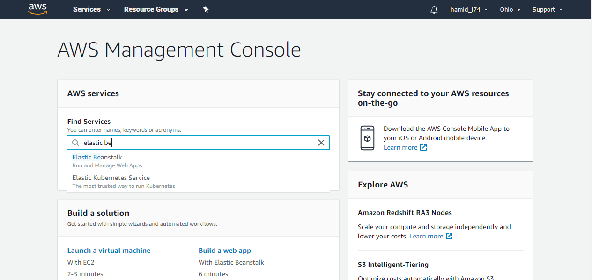

Then we must create an environment for our web application. In this section, we can configure our environment to test the application with different machine types.
 
 
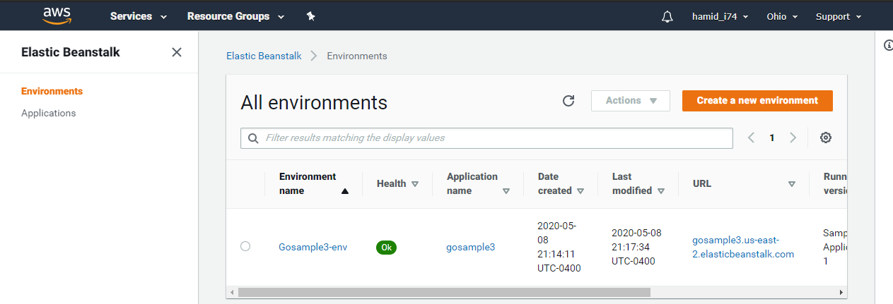

Here we should select “Web server environment” for deploying a web application.
 
 
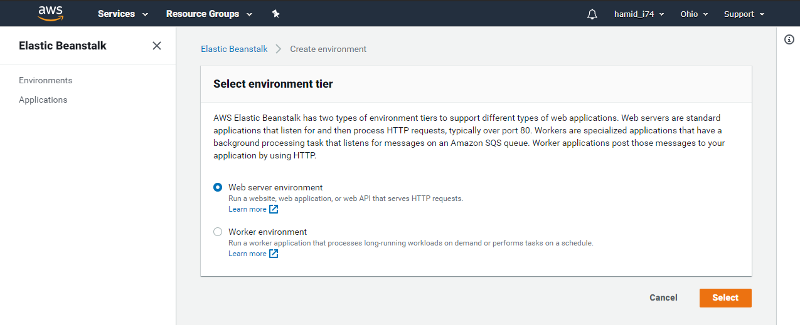

In the next section, we can choose a name and domain for our environment. For changing “.us-east-2.elasticbeanstalk.com”, we can change our region  which will also effect the price of the instance that we will use.

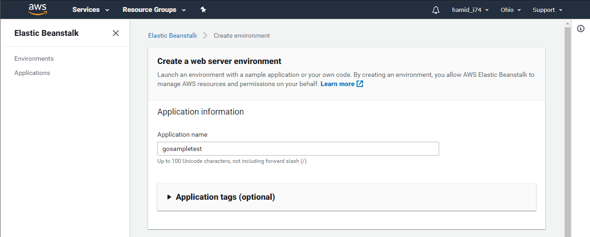

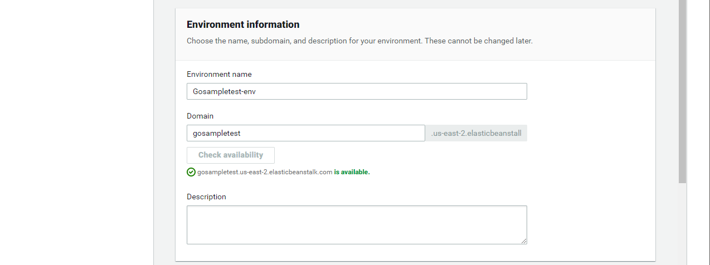

In platform section we should choose the language and platform branch that we have used to develop our web application. Here we have chosen “Go” and the proper platform branch (Screenshot 6).
 
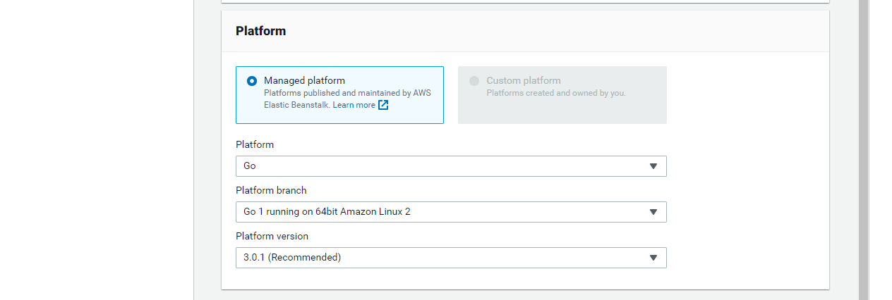

Screenshot 6.

For changing instance types, click on “Configure more options” and then we have to select “Edit” in Capacity box (Screenshot 7).
 
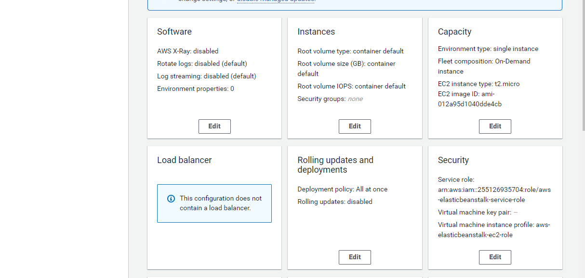

Screenshot 7.

Here, we can choose between different instance types (Screenshot 8).
 
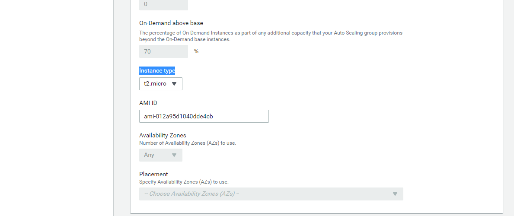

Screenshot 8.

Then we save the configurations and create the environment (Screenshot 9). It will take about 10 minutes.
 
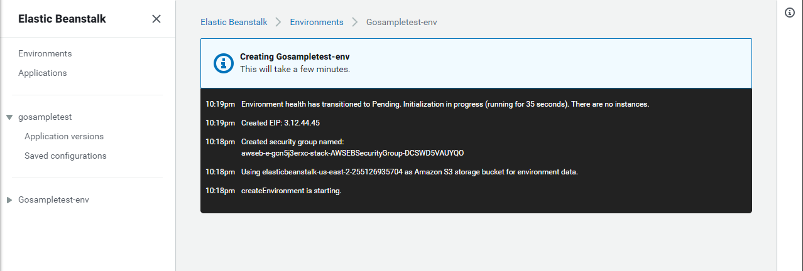

Screenshot 9.

Now we can upload and deploy our web application (Screenshot 10).
 

Screenshot 10.

# Distributed Load Testing on AWS

This AWS solution integrates various AWS services to simulate different workloads and determines your application’s behavior. That helps in identifying the bottlenecks before releasing the application. In other words, how the application is going to perform in production and at scale.

This solution uses Amazon Elastic Container Service ([Amazon ECS](https://aws.amazon.com/ecs/)) to spin up containers that will create hundreds of connections to your end point.

The following diagram shows the architecture of this solution:

The architecture consists of frontend and backend. In the frontend we have the web console which is a UI that we can use to interact with the solution. The UI uses Amazon CloudFront service to allow the user to configure the tests. We also have load testing API that is used to create tests and view the status of the tests. 

The backend comprises of docker image pipeline and load testing engine. The solution uses Taurus which is an open source software and has a Docker image that allows generating hundreds and hundreds of concurrent connections to the end point. The [Amazon S3](https://aws.amazon.com/s3/) service is a simple storage service which is used to store that image in your account. After that [AWS CodePipeline](https://aws.amazon.com/codepipeline/) and [AWS CodeBuild](https://aws.amazon.com/codebuild/) services are used to build that image and register it with [Amazon ECR](https://aws.amazon.com/ecr/) service that makes it easy for developers to store, manage, and deploy Docker container images.

The testing itself runs in [AWS Fargate]( https://aws.amazon.com/fargate/) service which runs your containers on the Elastic Container Service handling the networking and the underlying infrastructure. The [AWS Lambda]( https://aws.amazon.com/lambda/) service that takes the requests from the API to  run it in AWS Fargate. It also stores the test template in Amazon S3 and the information we are collecting in [Amazon DynamoDB](https://aws.amazon.com/dynamodb/). Then the [Amazon SQS]( https://aws.amazon.com/sqs/) service queues the tasks in AWS Fargate so that we can start spinning up the containers.  

# How to use Distributed Load Testing solution?
- Step 1: 
Launch the solution in the AWS console from this [link]( https://aws.amazon.com/solutions/distributed-load-testing-on-aws/”)
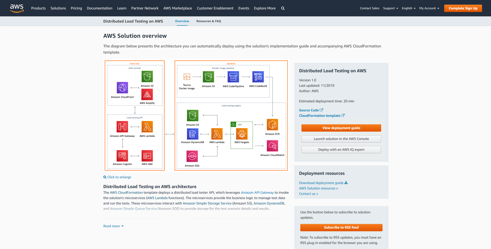

-	Step 2:
Keep the default settings and click on “Next” to create a stack.
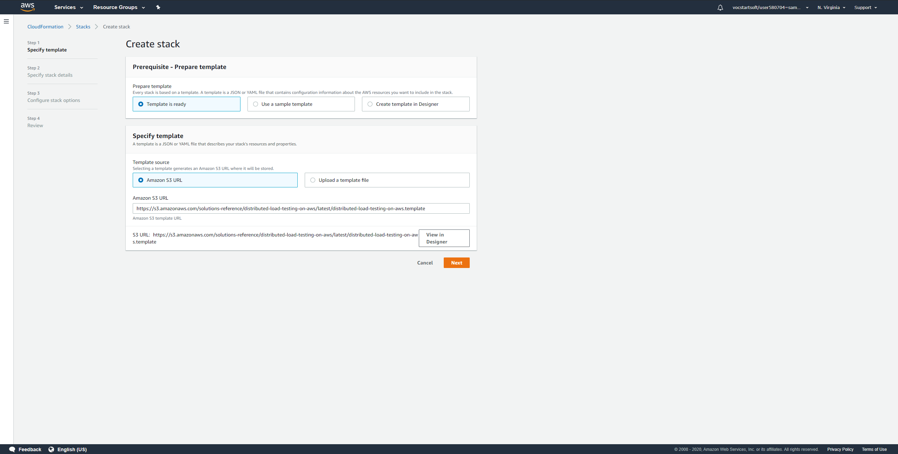

-	 Step 3:
Set the stack name, console administrator name, and console administrator email and click on “Next”.
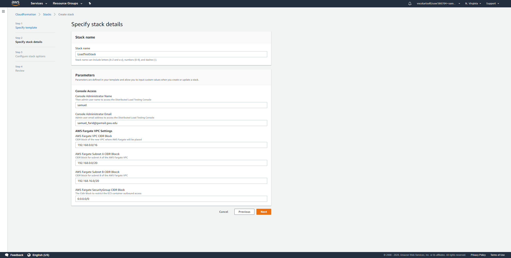
-	Step 4:
Add tags as needed, then click on “Next”.

-	Step 5:
Review your configuration and click on “Create stack” if everything is correct.
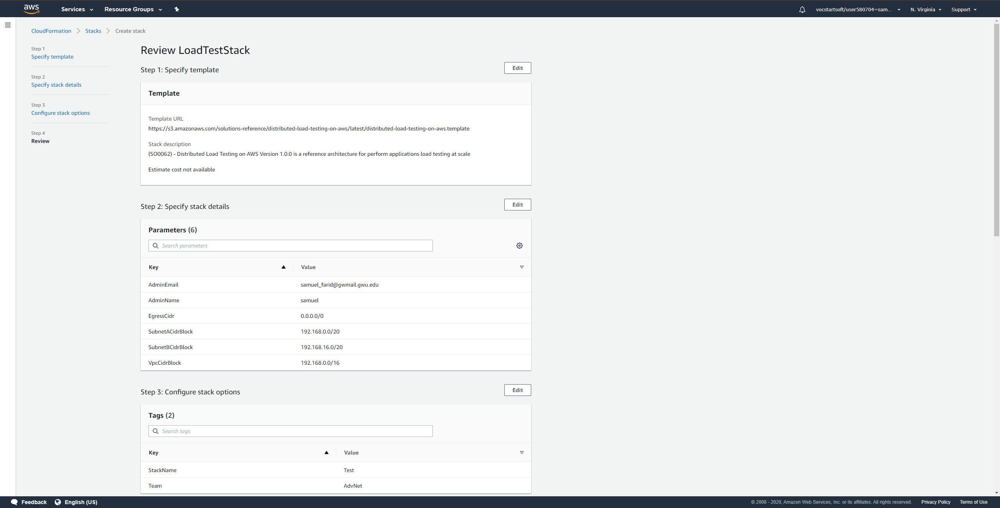
You will be redirected to a page showing that creating the stack is in progress.
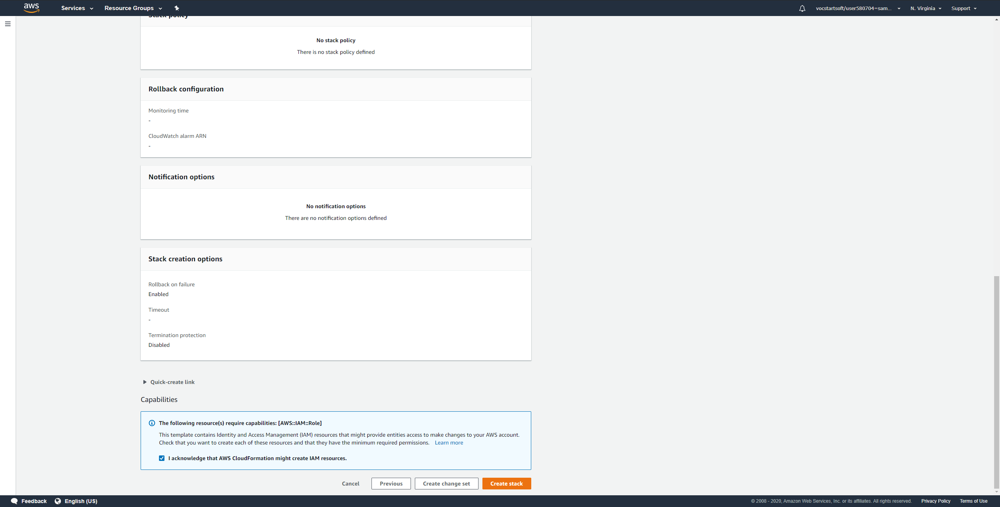
This page will show that the stack creation is completed after few minutes.
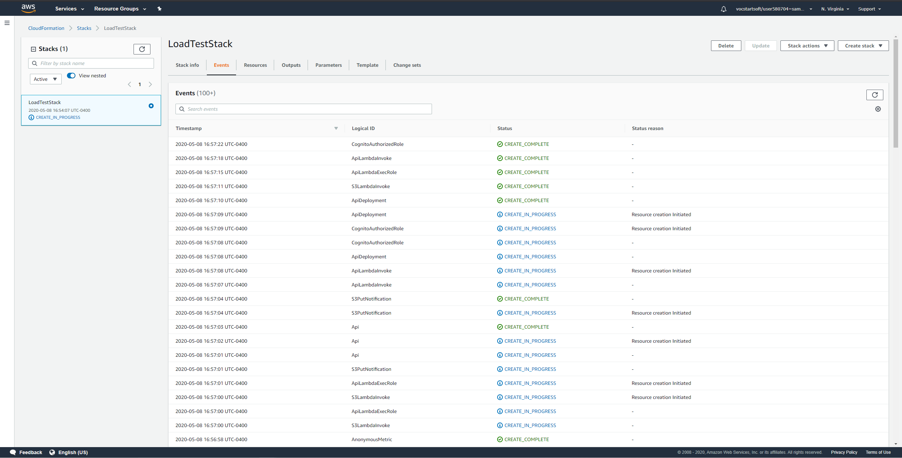

-	Step 6 
Click on “Outputs” tab, then you will find the console’s link. This console will be used to create and view tests. Use the username and password that was sent to the console administrator email when you are asked to login.
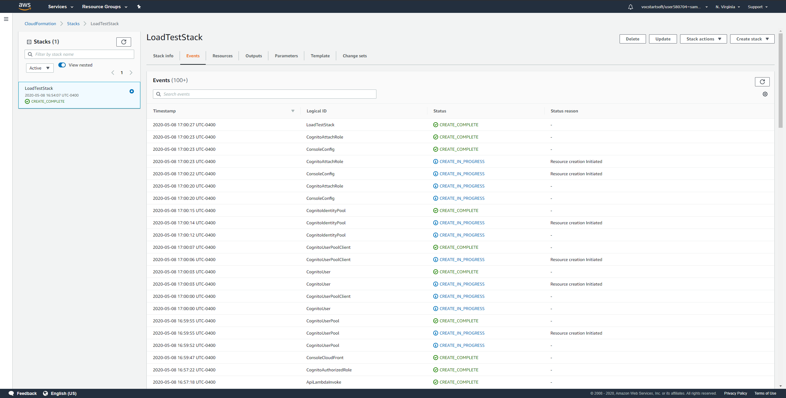

# Creating a test:
After logging in to the console you will be able to create a task.
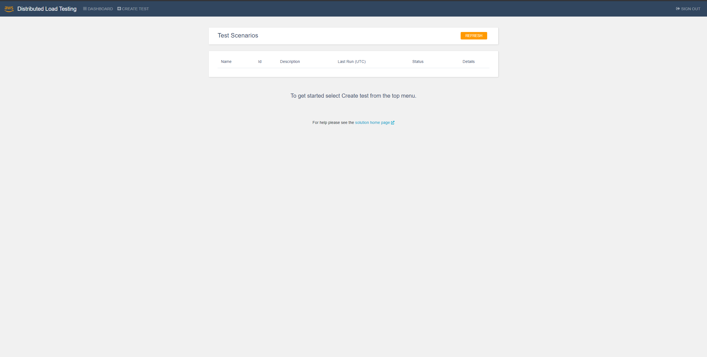
Enter the setting as required for your test and click on “Submit”
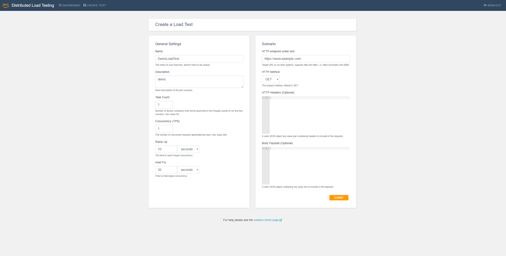
After that you will see the progress of the running task.
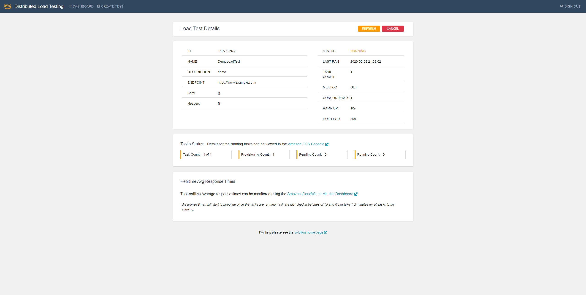
Finally, the results of the task will be shown:
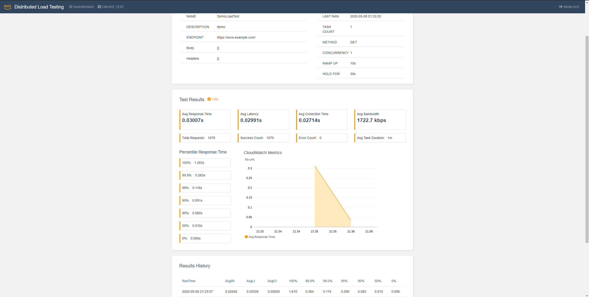

# Same load for web application running on different instances benchmark
We use the previously created four instances for load testing with the same load. The results are shown below:

